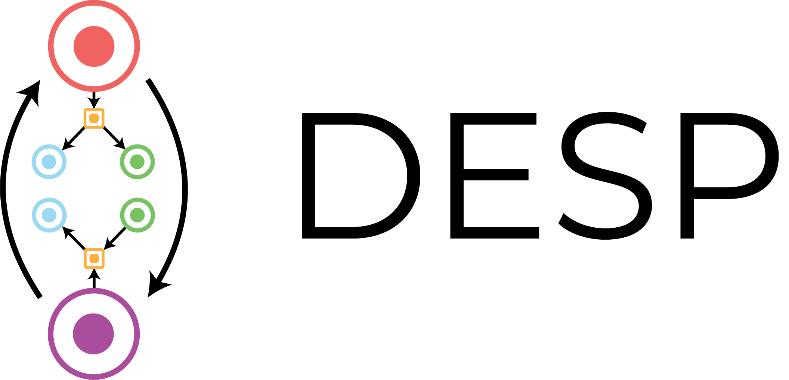

**Double-Ended Synthesis Planning with Goal-Constrained Bidirectional Search**\
_Kevin Yu, Jihye Roh, Ziang Li, Wenhao Gao, Runzhong Wang, Connor W. Coley_

This repo contains code for DESP (Double-Ended Synthesis Planning), which applies goal-constrained bidirectional search to computer-aided synthesis planning. DESP is designed to propose a synthesis plan towards a given target molecule under the user-specified constraint of using one or more specific starting materials. Read more about the algorithm in [our preprint](https://arxiv.org/abs/2407.06334).

**Update (September 2024)**: We are happy to announce that DESP was accepted into NeurIPS 2024 as a Spotlight paper!

## Quick Start

To reproduce our experimental results or to try DESP with our pretrained models, perform the following steps after cloning this repository.

#### 1. Environment Setup

DESP requires a GPU to run at a practical speed. Ensure that the `pytorch-cuda` dependency is compatible with the version of CUDA on your machine. To check, run the following command and look for the `CUDA Version`.
```bash
$ nvidia-smi
```

Now, create the `desp` conda environment from the project directory:
```bash
$ conda env create -f environment.yml
```

#### 2. Data and model installation

Download the pre-trained model weights [at this link](https://figshare.com/articles/preprint/25956076). Unzip the contents of `desp_data.zip` into `/desp/data/`. 

<details>
  <summary>All components and their descriptions (useful if you want to train your own models / use your own data)</summary>

  1. `building_blocks.npz` - Contains 256-bit Morgan fingerprints with radius 2 of each molecule in the building block catalog (eMolecules).
  2. `canon_building_block_mol2idx_no_isotope.json` - Corresponds to a dictionary indexed by the SMILES strings of each molecule in the building block catalog.
  3. `idx2template_fwd.json` - Maps one-hot encoded indices of each forward template to the SMARTS string of the template for the forward template model.
  4. `idx2template_retro.json` - Maps one-hot encoded indices of each retro template to the SMARTS string of the template for the one-step retrosynthesis model.
  5. `model_bb.pt` - Checkpoint of the building block model. Input dim: 6144. Output dim: 256.
  6. `model_fwd.pt` - Checkpoint of the forward template model. Input dim: 4096. Output dim: 196339.
  7. `model_retro.pt` - Checkpoint of the one-step retro model. Input dim: 2048. Output dim: 270794.
  8. `retro_value.pt` - Checkpoint of the Retro* value model. Input dim: 2048. Output dim: 1.
  9. `syn_dist.pt` - Checkpoint of the synthetic distance model. Input dim: 4096. Output dim: 1.
  10. `pistachio_hard_targets.txt` - Line-delimited text file of pairs of targets and their starting material for benchmarking on Pistachio Hard. (i.e. `('CCOc1cc(-c2ccc(F)cc2-c2nncn2C)cc(-c2nc3cc(CN[C@@H]4CCC[C@@H]4O)cc(OC)c3o2)n1', 'CCOC(=O)c1cc(F)ccc1Br')`)
  11. `pistachio_reachable_targets.txt` - Like above, but for the Pistachio Reachable test set.
  12. `uspto_190_targets.txt` - Like above, but for the USPTO-190 test set.
</details>

#### 3. Run experiments

To reproduce the experiments, navigate to the directory `/desp/experiments/` and run the evaluation script. The first argument refers the benchmark set to use, while the second argument refers to the method to use. The results of the experiments will be saved in `/desp/experiments/<benchmark_set>/<method>.txt`, along with a corresponding `.pkl` file containing the full search graphs of each search.
```bash
$ sh evaluate.sh [pistachio_reachable|pistachio_hard|uspto_190] [f2e|f2f|retro|retro_sd|random|bfs]
```
A GPU is required for DESP-F2E or DESP-F2F. Specify the device in the evaluation script and ensure that your GPU has enough memory to load the building block index (around 3 GB). Additional memory is required for DESP-F2F due to batch inference of the synthetic distance predictions. The forward prediction module takes a few minutes to initialize as it loads the index into memory.

#### 4. Run DESP on your own targets and starting materials

To run DESP on your own specified targets and starting materials, navigate to the `/desp/` directory. In a Python environment (IPython notebook, Python shell, Python script), initialize and invoke DESP with default parameters as follows:
```Python
from DESP import DESP

desp = DESP(strategy='f2e')                 # switch to 'f2f' if you want to try F2F
result, route = desp.search(
    'COC(=O)CC12CCC(c3ccc(Br)cc3)(CC1)CO2', # Target SMILES
    ['COC(=O)C1(c2ccc(Br)cc2)CCC(=O)CC1']   # List of starting materials SMILES
)
```
The following keyword arguments are currently supported for the search API:
- `iteration_limit`: Maximum number of expansions for the search algorithm. Default: `500`
- `top_n`: Number of retro templates to consider for retro model. Default: `50`
- `top_m`: Number of forward templates to consider for forward template model. Default: `25`
- `top_k`: Number of building blocks to consider in k-NN search. Default: `2`
- `max_depth_top`: Maximum depth (including reaction nodes) for top-down search. Default: `21`
- `max_depth_bot`: Maximum depth (including reactoin nodes) for bottom-up search. Default: `11`
- `must_use_sm`: Flag to enforce the starting material constraint. Default: `True`

If DESP is able to find a route for the given inputs, the route can be visualized by running:
```Python
desp.visualize_route(route, 'route')
```
This will save a DOT file `/desp/route` and image file `/desp/route.png` to the directory which visualizes the solved route. To view the image directly in a IPython notebook, you can run, for example:
```Python
from IPython.display import Image

Image("route.png", width=300)
```

## Processing and Training from Scratch

See the guide at `/processing/README.md`.

## Acknowledgements

We thank the developers of [ASKCOS](https://gitlab.com/mlpds_mit/askcosv2/) and [Syntheseus](https://github.com/microsoft/syntheseus/) for releasing open source implementations of CASP algorithms that were referenced or adapted for this work.

## Citation

```bibtex
@misc{yu2024doubleendedsynthesisplanninggoalconstrained,
      title={Double-Ended Synthesis Planning with Goal-Constrained Bidirectional Search}, 
      author={Kevin Yu and Jihye Roh and Ziang Li and Wenhao Gao and Runzhong Wang and Connor W. Coley},
      year={2024},
      eprint={2407.06334},
      archivePrefix={arXiv},
      primaryClass={cs.AI},
      url={https://arxiv.org/abs/2407.06334}, 
}
```